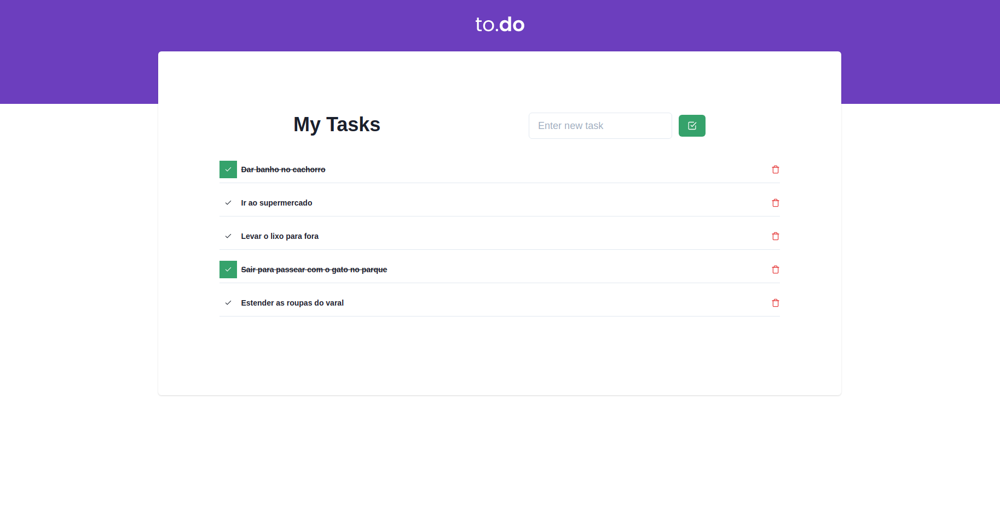

<p align="center">
  
</p>

<h1 align="center">
    
</h1>

<br>

## 🧪 Tecnologias

Esse projeto foi desenvolvido com as seguintes tecnologias:

- [Chakra-UI]
- [Next.js]
- [TypeScript]

## 🚀 Como executar

Clone o projeto e acesse a pasta do mesmo.

```bash
$ git clone https://github.com/nar0n-dev/to-do.git
$ cd to-do
```


Para iniciá-lo, siga os passos abaixo:
```bash
# Instalar as dependências
$ yarn

# Iniciar o projeto
$ yarn dev
```
O app estará disponível no seu browser pelo endereço http://localhost:3000.

## 💻 Projeto

To do foi criado com o objetivo de auxiliar o usuário com as tarefas e atividades do dia-a-dia, de uma forma simples e amigável de interação. Atualmente o App, não armazena os dados, ou seja, ao atualizar a página os dados vão sumir, em breve farei mais atualizações.

Feito com 💜 por nar0n 👋🏻.